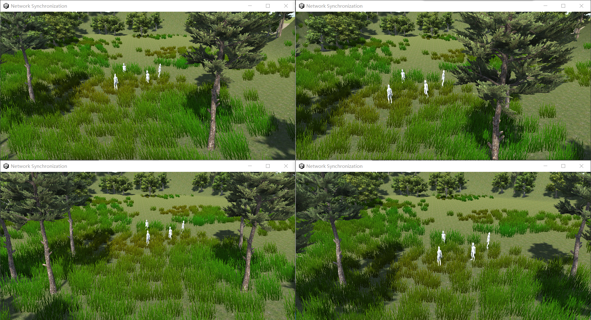

# Net Synchronization

a simple demo of command synchronization with frontend use unity and backend use go



## principle

1. use unity websocket to connect to go server
2. send command like `<action>|<arg1>,<arg2>,<arg3>,...` to server
3. server according to the command to do the corresponding action
4. unity receive the result from server and do some dispose


## How to run

to run this demo, you need to install unity and go

### unity

you need to import 'Standard Assets' from Unity Asset Store.

at least, you need to import all the packages in 'Standard Assets' except '2D'.

and you need to install 'Cinemachine' from Unity Asset Store.

### go

you need to install go and set the GOPATH

and need to install gnet package

```bash
go get github.com/panjf2000/gnet
```
then, you build the server

```bash
go build main.go server.go
```

and run the server

```bash
./main
```

when command line show like following, it means the server is running

```bash
2022/09/21 15:04:29 Game server is listening on [::]:9000 (multi-cores: true, loops: 12)
```

then you can run unity client to connect the server
